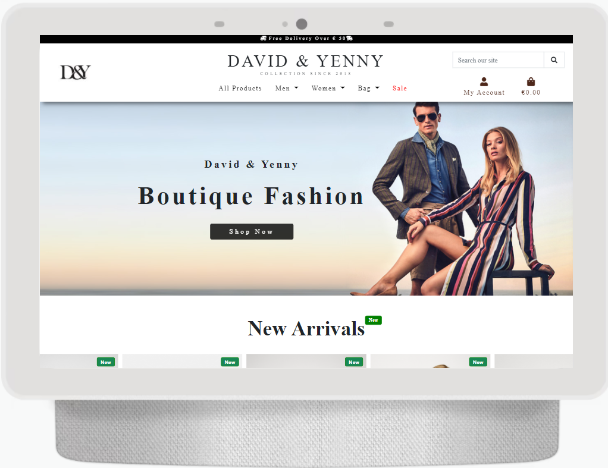
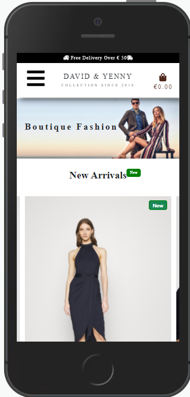
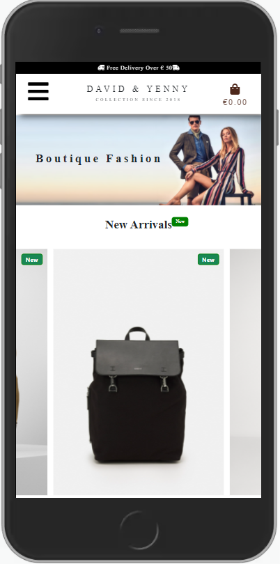
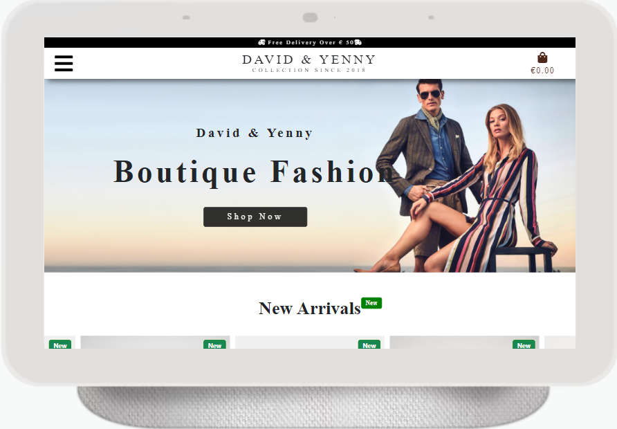
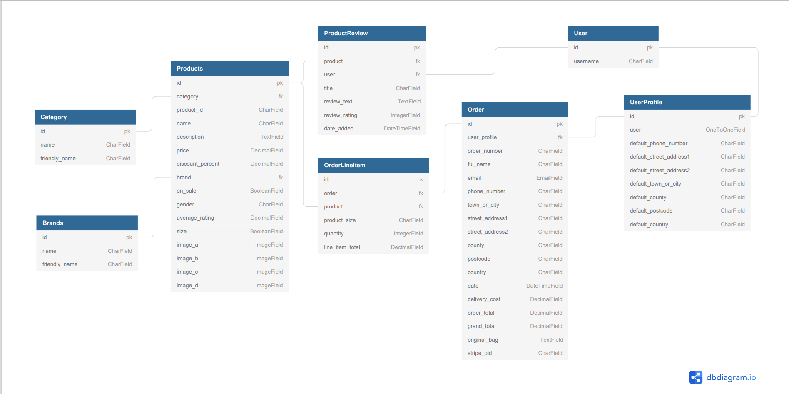

# David & Yenny Collection ( Online Fashion Boutique)

[View Live Project Here](https://d-y-collection-milestone-4.herokuapp.com/)

## Full Stack Framework Milestone 4 project.

### Overview

This project presents a Online Fashion Boutique call David & Yenny Collection. Boutique provides both fashionable & stylish range of clothes and bags both for men's and women's. I have designed this project/ecommerce store , fully focus on Database creation, security and UI / UX. Website has a few diffrent webpages each page has different contents and product description but as user prospective each webpage will easily and smoothly will navigate user to their destination.

# Highlights

 * [User Experience (UX)](#User-experience-UX)

   * [User Desire](#user-desire)

   * [User Stories](#user-stories)

 * [Design](#design)

   * [Colors](#colors)

   * [Typography](#typography)

   * [Imagery](#imagery)

   * [Icons](#icons)

   * [Wireframes of website](#wireframes-of-website)

   * [ Responsive Screenshots ](#responsive-screenshots)

 * [Database Model](#database-model) 

 * [Features](#features)

 * [Technology used in a Project](#technology-used-in-a-Project)

 * [Testing](#testing)

 * [Deployment](#Deployment)
 
 * [Credits](#credits)

 
 #  User Experience (UX)

 ## User Desire

  
  * User will be easy intractive with the Webiste beacuse all the webpages/navlinks will easily and smoothly will navigate 
    user to their destination.

  * User is looking for online webstore with product offers and wide range of stylish and modern clothes.

  * User is looking for online webstore where user is able to make a login and profile so they can save their purchase details for future need.

  * User is looking for online webstore where they can read and leave product review.

  *  User is looking for online webstore after order has processed, they will have purchase conformation by email.
  

[Back to Highlights ](#highlights)

 ## User Stories  

 * As a first Time Visitor!

    * I want to easily understand the main purpose of the site so I can decide to stay longer.

    * I want to all the webpages/navlinks will easily and smoothly navigate user to their destination.

    * I want  to search for sale products  or just any particular product without spending much time.

    * I want to buy a product without  registration or login.

    *  Getting a full order conformation by email.

    *  I want to Read product review so I will know about product quality. 

    *  I want to make login and save my profile for future purchase.

    *  I want to able to  recover my password if I forgotten it.

    *  I want to ensure my personal information/bank card detail is safe and secure.

 * As a returning visitor:

    * Able to easily register and update my profile information.

    *  Able to leave product review easily.

    *  Able to see my purchase history, what I have purchased.

    *  Able to save my contact details.

    * Able to get free order delivery to save money.

 *   As an Author of the site:

     * Be able to add new Products CRUD (author can Update, add, delete products stock according to its popularity or unpopularity )!

     * As a Author I want to fully Ensure website is safe and secure, so I can secure my company and reputation.
 
     * Be able to change sale discount percent according to occasion or festivals offers.

     * Be able to Delete inappropriate product reviews, which could affect business.

# Strategy 

 * As a author I have Choose a white bg and light colors for web design that will help to convert visitors to regular user.
   The home page contain some of the beautiful products images and carousel which will attract visitors to find out more about 
   website.

 * As a Author I have Choose this unique name , logo and design which will help my business to attract new users.

 *  As a Author I have placed one christmas sale section which will hold my user to stay tuned until christmas sale..

[Back to Highlights ](#highlights)

# Design

  ### Colors 

  * Themecolor of the webpage is white. White color has used as background color through out the whole website.I have placed three buttons on the home page color of orange And black background with white text.The main purpose behind to use just white background, black text and the images with light background used through out the project is to make user intraction above.

  * Main nav which is clean and clear white color with black text and beautiful logo of company, I have used box shadow to make nav bar more user intrative.

  * Mobile navigation menu (side bar) with a clear white background with black text and  with red color left border on each nav links when its drop down which will  be imaging  experience for customer/user.

  * Fade color #abbaab and box shadow used in footer which is perfectly good combination with rest of the website and more user intrative.

  ### Typography 

   * There will be two fonts used throughout the website. Roboto , Playfair Display SC and Serif specific so that will be used for the fall back font,
      Playfair Display SC font used in  webpage headings and 80% content to make more user intractive.

  ### Imagery

   * Choices of the images is an important component of this website both product images and the other images used through out the website. I choosed clean images that will intract Visitors. Hero image at the home page to catch the visitors intrerest and strategically add Flickity carousel which contains some stunning new arrival products images and bottom of the page christmas day timer which count down the christmas sale, which will help to attract visitors to look more in side webpage.

   * Brand logo D & Y is represents a family brand name David & Yenny which is it self great attraction for user to know more about brand and products.

  ### Icons 

   * All icons used has taken from Font Awesome [Font Awesome.](https://fontawesome.com/). I have used search button icon,bag icon, user account icon, 
     direction icon used in keep shopping buttons, edit ,delete ,add produts and product review, dropdown menu and for external links social media
     icon in the footer.

  ### Wireframes of website

  I used a balsamiq to create a wireframe. Here is link [balsamiq](https://www.balsamiq.com/)

  [Home Page](https://share.balsamiq.com/c/p7vuW6A6X9ZKB1G5sMRbMH.png) 

  [Product Page](https://share.balsamiq.com/c/WHwCLtJd5qhjaGesYQbg6.png) 

  [Product Detail](https://share.balsamiq.com/c/hMXGnAmdFAnFegsaQs9VLB.png) 

  [Bag Page](https://share.balsamiq.com/c/tSDn1chacg569Ut1fLti8M.png)

  ### Responsive Screenshots

  

  
 
  

 
  

  

  [Back to Highlights ](#highlights)

# Database Model

 During development the website will use SQLite3 which is the default database used by Django. Once deployed the website will use a PostgreSQL database which can be added/hosted by Heroku.

 The database schema was captured using [DB Diagram](https://dbdiagram.io/home)

 
  

## Profile App

### User Profile Model

|Name             |Database Key            |Field Type         | Validation Requirements                     |
|-----------------|------------------------|-------------------|---------------------------------------------|
|User             |user                    |OneToOneField(User)|on_delete=models.CASCADE                     |
|Phone Number     |default_phone_number    |CharField          |max_length=20, null=True, blank=True         |
|Street Address 1 |default_street_address1 |CharField          |max_length=80, null=True, blank=True         |
|Street Address 2 |default_street_address2 |CharField          |max_length=80, null=True, blank=True         |
|Town or City     |default_town_or_city    |CharField          |max_length=40, null=True, blank=True         |
|County           |default_county          |CharField          |max_length=80, null=True, blank=True         |
|Postcode         |default_postcode        |CharField          |max_length=20, null=True, blank=True         |
|Country          |default_country         |CountryField       |blank_label='Country', null=True, blank=True |

## Products App

### Category Model
| Name             | Database Key            | Field Type              | Validation Requirements                               |
|------------------|-------------------------|-------------------------|-------------------------------------------------------|
| Name             | name                    | CharField               | max_length=254                                        |
| Friendly Name    | friendly_name           | CharField               | max_length=254, null=True, blank=True                 |

### Brand Model
| Name             | Database Key            | Field Type              | Validation Requirements                               |
|------------------|-------------------------|-------------------------|-------------------------------------------------------|
| Name             | name                    | CharField               | max_length=254                                        |
| Friendly Name    | friendly_name           | CharField               | max_length=254, null=True, blank=True                 |

### Product Model
| Name             | Database Key            | Field Type              | Validation Requirements                               |
|------------------|-------------------------|-------------------------|-------------------------------------------------------|
| Sku              | sku                     | CharField               | max_length=254, default="", blank=True                |
| Category         | category                | ForeignKey              | null=True, blank=True, on_delete=models.SET_NULL      |
| Brand            | brand                   | ForeignKey              | null=True, blank=True, on_delete=models.SET_NULL      |
| Name             | name                    | CharField               | max_length=254L                                       |    
| Description      | description             | TextField               | None                                                  |        
| Price            | price                   | DecimalField            | max_digits=6, decimal_places=2                        |    
| On Sale          | on_sale                 | BooleanField            | default=False, blank=True                             |
| Discount Percent | discount_percent        | DecimalField            | max_digits=2, decimal_places=0, blank=True, null=True |
| Image A          | image_a                 | ImageField              | null=True, blank=True                                 |
| Image B          | image_b                 | ImageField              | null=True, blank=True                                 |
| Image c          | image_c                 | ImageField              | null=True, blank=True                                 |
| Image d          | image_d                 | ImageField              | null=True, blank=True                                 |   
| Average Rating   | average_rating          | DecimalField            | max_digits=4, decimal_places=2, null=True, blank=True |   
| Gender           | gender                  | CharField               | max_length=1, choices=GENDER                          |
| Size             | size                    | BooleanField            | default=False, null=True, blank=True                  |   
| Date Added       | date_added              | DateTimeField           | default=timezone.now                                  |

### Review Model
| Name            | Database Key   | Field Type           | Validation                                                                |
| --------------- | -------------- | ---------------------| --------------------------------------------------------------------------|
| User            | User           | ForeignKey(User)     | on_delete=models.CASCADE, null=False, blank=False, related_name='review'  |
| Product         | product        | ForeignKey(Product)  | on_delete=models.CASCADE, null=False, blank=False, related_name='product' |
| Title           | title          | CharField            | max_length=254                                                            |
| Review Text     | review_text    | TextField            | None                                                                      |
| Review Rating   | review_rating  | IntegerField         | choices=RATING, default=5                                                 |
| Date Added      | date_added     | DateTimeField        | auto_now_add=True                                                         |

## Checkout App

### Order Model
| Name                     | Database Key    | Field Type                 | Validation                                                   |
| ------------------------ | --------------- | ---------------------------| -------------------------------------------------------------|
| Order Number             | order_number    | CharField                  | max_length=32, null=False, editable=False                    |
| User Profile             | user_profile    | ForeignKey(UserProfile)    | on_delete=models.SET_NULL, null=True, related_name='orders'  |
| Full Name                | full_name       | CharField                  | max_length=50, null=False, blank=False                       |
| Email Address            | email           | EmailField                 | max_length=254, null=False, blank=False                      |
| Phone Number             | phone_number    | CharField                  | max_length=20, null=False, blank=False                       |
| Country                  | country         | CountryField               | blank_label='Country *', null=False, blank=False             |
| Postcode                 | postcode        | CharField                  | max_length=20, null=True, blank=True                         |
| Town or City             | town_or_city    | CharField                  | max_length=40, null=False, blank=False                       |
| Street Address 1         | street_address1 | CharField                  | max_length=80, null=False, blank=False                       |
| Street Address 2         | street_address2 | CharField                  | max_length=80, null=True, blank=True                         |
| County                   | county          | CharField                  | max_length=80, null=True, blank=True                         |
| Date                     | date            | DateTimeField              | auto_now_add=True                                            |
| Delivery Cost            | delivery_cost   | DecimalField               | max_digits=6, decimal_places=2, null=False, default=0        |
| Order Total              | order_total     | DecimalField               | max_digits=10, decimal_places=2, null=False, default=0       |
| Grand Total              | grand_total     | DecimalField               | max_digits=10, decimal_places=2, null=False, default=0       |
| Original Bag             | original_bag    | TextField                  | null=False, blank=False, default=''                          |
| Stripe Payment Intent ID | stripe_pid      | CharField                  | max_length=254, null=False, blank=False, default=''          |

### Order Line Item Model
| Name            | Database Key   | Field Type          | Validation                                                                   |
| --------------- | -------------- | --------------------| -----------------------------------------------------------------------------|
| Order           | order          | ForeignKey(Order)   | null=False, blank=False, on_delete=models.CASCADE, related_name='lineitems'  |
| Product         | product        | ForeignKey(Product) | null=False, blank=False, on_delete=models.CASCADE                            |
| Quantity        | quantity       | IntegerField        | null=False, blank=False, default=0                                           |
| Line Item Total | lineitem_total | DecimalField        | max_digits=6, decimal_places=2, null=False, blank=False, editable=False      |

[Back to Highlights ](#highlights)

# Features

## Existing Features

  Every page of the website features a consistently responsive and intuitive layout and navigational system:
 
 ### General features

  *  All the webpages are fully responsive on all devices.

  *  Footer will seen on  most of all the important pages it contains Company name and social links as well.

  *  All the  cards images and text are fully responsive.

  *  Search functionality which will help to find products by name and category.

 ### Header
   
  * The header will be in a fixed position at the top of the screen and will not scroll with the page contents. This allows visitors easy access to navigate the site via the menu.

  * The header will include a company name under the name all the nav-links some of them are dropdown menu and on right side on top one search bar which will help user to find products faast on just one click, under the search bar I have placed user account menu and cart.

  * The navigation links in the My Account dropdown will change when the user is registered and logged in.

  * On mobile menu all the links has shifted in side bar push menu, header just contain company name,on left side mobile menu button and right side cart.

 ### Home page 

  * Home page contains some beautiful images will attract user.

  * On Home page under the hero image I have placed Flickity carousel which contains new arrival products with nice Auto-play.
    Auto-playing will pause when mouse is hovered over, and resume when mouse is hovered off. Auto-playing will stop when the carousel is clicked or a cell is selected.

  * Under the  carousel there is two product image one is belongs to men's products and other one to women's products.. both images navigate user to particular product but the buttons lead user to men's all product and women's  all products.  

  * At the bottom of page Strategically placed christmas sale timer which will attract more users.

 ### Product Page

  * The Product page will display a list of all the products available on the site or the products from a particular category. This could be men's, women's, bag and sale  products.

  * The page will clearly display the product image, product name, product category and price of the product.

  * Clicking on the product image will open up a new page containing more details on the selected product.

  * If the user is super user/ author! there is some addition links on each item allow the  super user to edit/delete the product.

 ### Product Detail

  * This will display all data associated with a particular product. There will be button to allow the user to add the product to their shopping basket.

  * If the user is super user/author! there is some addition links on each item allow the  super user to edit/delete the product.

  * There is product review section where loged in user can add their product review.

  * At the bottom of the page there is product related section where user is able to see some extra products which will be related to users choosen product.

 ### Shopping Bag Page

  * The shopping bag will display all items that that have been added by the user.
  
  * For each item it will show the unit price, quantity and subtotal.

  * The user can change the quantity against each item and also remove it from their back if they no longer wish to purchase the product.

  * At the bottom of the page the basket total, delivery cost and order total will be displayed.

  * A Keep Shopping & Checkout button will also be displayed at the bottom of the page.

  [Back to Highlights ](#highlights)