#  Project Testing

   * [ Functionality Test ](#functionality-test)
        
   * [ Compatibility testing ](#Compatibility-testing) 

   * [Code Validation Test](#Code-validation-test)
 
   * [User Stories Testing](#user-stories-testing)

   * [Error found during site development ](#Error-found-during-site-development)
       
   * [ Performance Testing ](#performance-testing)

## Functionality Testing

 * I used Chrome developer tools throughout the project for testing and solving problems with responsiveness and 
     style issues.

## Compatibility Testing 

  * The website has been tested across a broad range of physical and virtual desktop, tablet and mobile devices. Additionally, the site has been checked on a browsers including Chrome, Edge.

  * Project has been tested on different Physical  devices such as Desktop PC , Ipad and on diffrent Mobiles Iphone x, Samsung Note 20 ,iphone 7 it works 
    great and its fully responsive.

    

    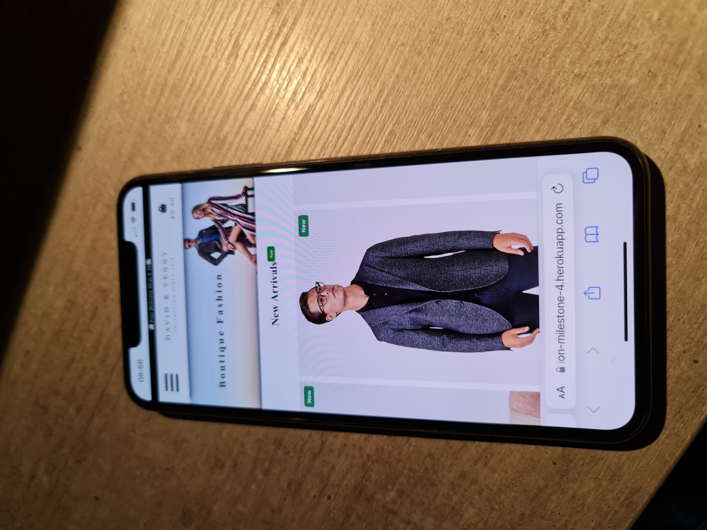

    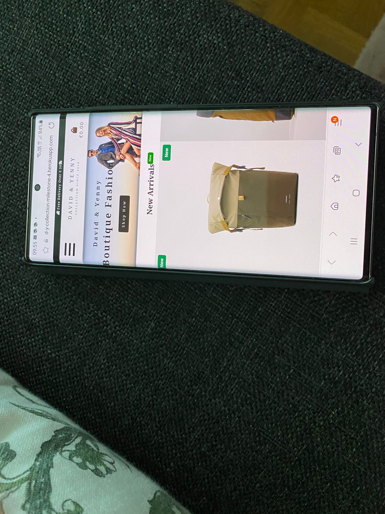
 
   [Back to Highlights ](#highlights)

  * Virtual devices have consisted of the following on Google Chrome:

    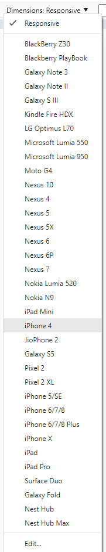

## Code Validation Test

 PEP8 online, JSHint, W3C Markup Validation Service and CSS Validation Service were used to validate all project pages ensuring no syntax errors are present.

 ### HTML

  * To make it easier to validate html code, since using Django throughout all pages, which results in errors in online validators.

  * There was no error on html pages but there was warning caused on some of the webpages because of  missing div , section , <h> and 
 tags.

 ### CSS Validation

 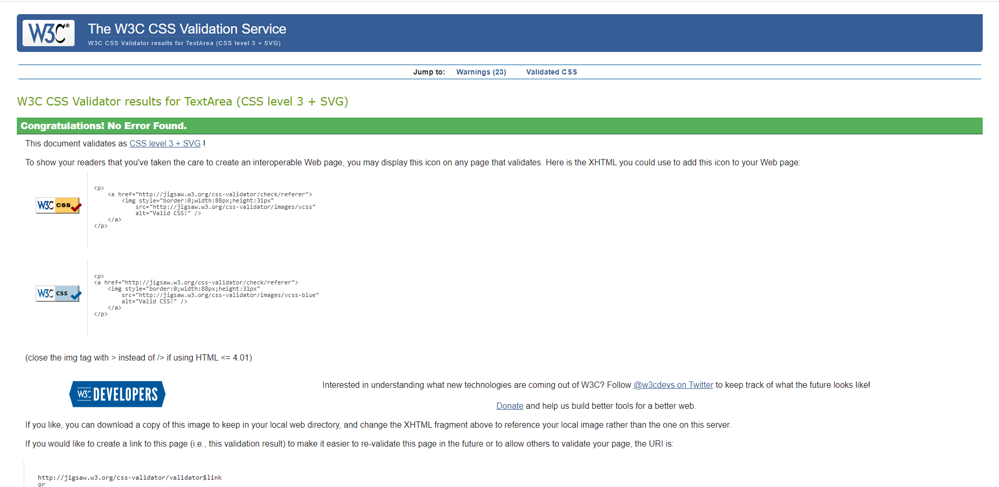

 ## User Stories Testing

 ### First Time Visitor Goals 
 
  #### Quickly understand what the site is about

   * When visitor enters website, the visitors is welcomed by a some stunning product images and  carousel which contains new arrival product images  another thing a really clean and white bg header with drop down menu that clealy explains the purpose of the site,A customer should be left in no doubt what the site is selling.

   
  #### Browse Products

  * On Home page under the hero image provide carousel which contains new arrival product images which moves right to left, Auto-playing will pause when mouse is hovered over, and resume when mouse is hovered off. Auto-playing will stop when the carousel is clicked or a cell is selected. One click will bring user to that particular product detail. 
    
    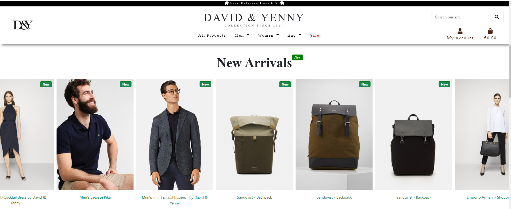

  * Under the home page Carousel there is two diffrent section one is men's fashion and other one is women's fashion on click which will lead user to that particular 
  product category. There is one buttton on each image which will lead user to that particular gender category.

     

  * In the navbar there are links to All Products and drop-down menus for Men , Women and Bag. There is other links on the navbar for sale Products and User account.

    

  * Navigation bar provides one serach bar which will help user to save time to find fast any particular product or category on just one click.
 
      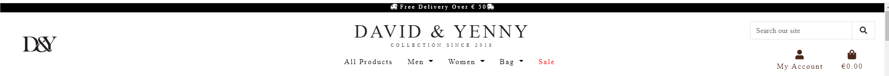

  * There is a ‘Sort by’ option on all the products pages from which the customer can order by price and name from high to low or low to high.
     
      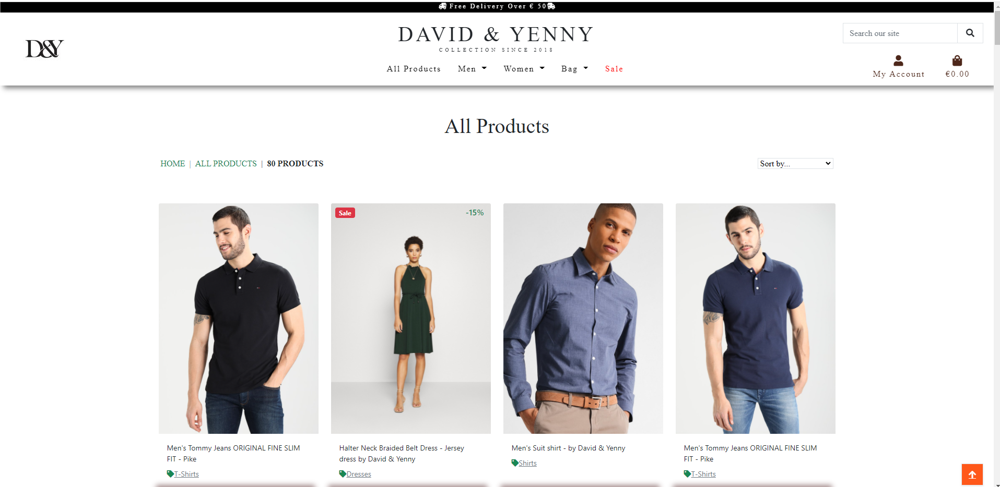

  * There is one button on Hero image of Home page for Shop Now which  will take the customer to the All products page.

   

 * There is brands section each brand leads user to that particular brands products.

   

  * At the bottom of the home page I have placed one  christmas count down which will make user to stay connect with website.

    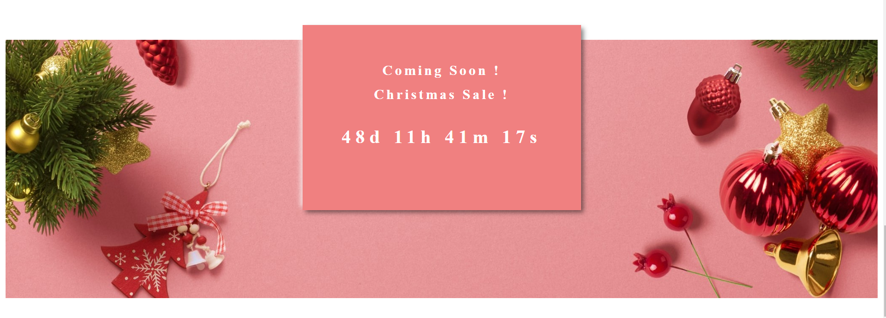
 
 [Back to Highlights ](#highlights)

#### Sale Products

 * There is a link to sale products on the navbar.

 * The products on sale have a red badge in the top left of the product card labelled ‘Sale’ and product discount percent have green color, its on right top of card. This should be clearly visible to customers in the product.

   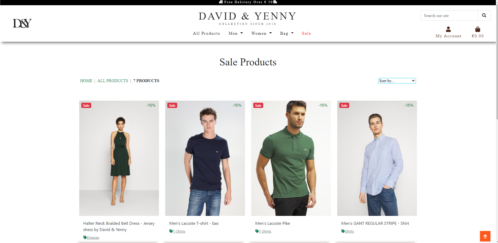

#### Related Products 

   * In the product detail page related products are shown below the product Review.

   * Related products are from the same product category and same gender.

   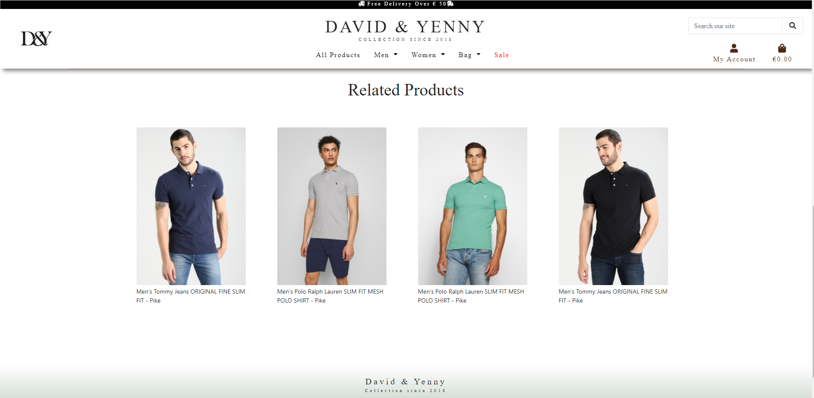

#### Purchase a product without register/login

  * products can be purchased without registering. 

  * Registration/login is required to save personal details and to see purchase history as well as leave a review.

#### Register 

 * The customer signs up with email address, username and password, User account link top right under the serach bar and in mobile menu at bottom of the drop-down menus.

    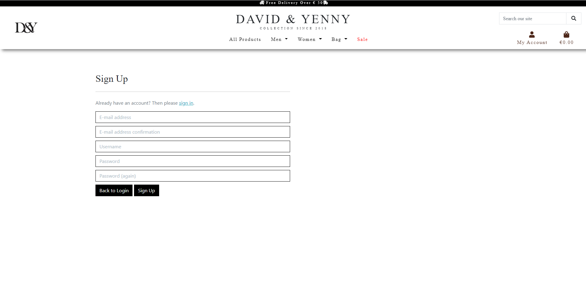

 * A verification email is sent with a link to confirm this is correct.

 *  The link returns the customer to the David & yenny collection site where they are required to click the Confirm button to complete the registration process.

#### Receive messages 

 * The customer receives success, informational or error messages to confirm actions throughout the site.

     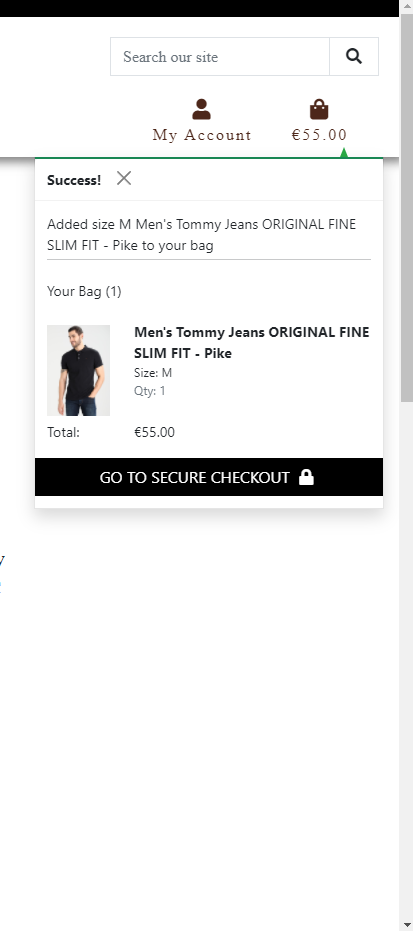
 
 [Back to Highlights ](#highlights)

#### Recover Password 

 * There is a ‘Forgot Password?’ link on the login screen.

   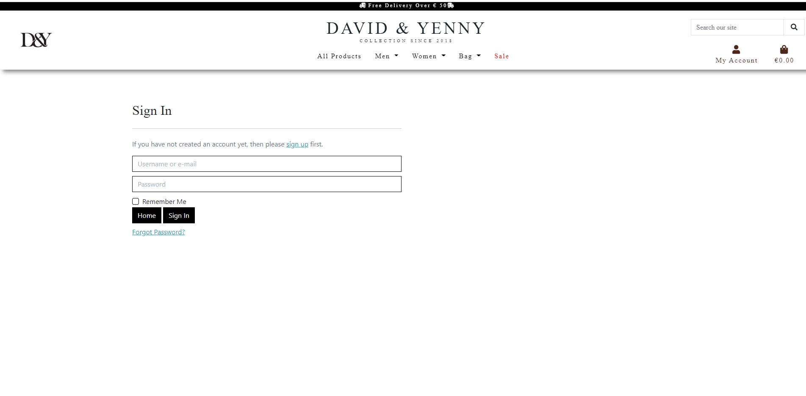

 * The user is required to re-enter their email address and click Reset My Password.

 * A confirmation message is displayed and email sent. 

 * The user has to click the link in the email to create a new password. 

#### Account Security 

  * User accounts are protected by Django Allauth.

  * Payments are secured by Stripe and webhooks to ensure the process completes.

### Returning Visitor 

 #### Save my contact details 

 * At checkout there is a checkbox to ‘Save delivery address to my profile’ for authorised users.

#### See previous orders 

 * Order history is available in the Profile page.

#### Add a review 

 * The Add Review form is displayed in the Reviews section if the user is authenticated.

 * User has authorization to add review but can't edit or delete them just super user can delete any unsatisfactory reviews.

#### Log in and out 

  * As a returning visitor, I want to be able to easily log in, if I already registered last time visiting. Visitor can click on my account drop-down menu on right top to login.

 [Back to Highlights ](#highlights)

 

  
